# Fortigate
> Importante! Estos cambios en forti producen desconexión por lo que se recomienda hacerlo fuera de hora

Para borrar el certificado digital existente, requiere que sea eliminado de todas las referencias primero para finalmente eliminarlo desde system-certificates, es recomendable importar el nuevo primero y aplicar su configuración.

**Referencias actuales:**
- Security profiles / ssl-ssh inspection / tqcorp.com
- VPN/SSL-VPNSettings / server certificate
- User & authentication / authentication settings / certificate
- System / Settings / HTTPS server certificate

## Procedimiento
Certificates / Import / local certificate y completar de la siguiente manera:

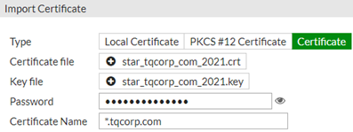

Utilizar el certificado nuevo cargado en todas las referencias donde fue eliminado anteriormente

# Ubiquity

*Es necesario pre cargar en el servidor 16mon01 el certificado y la key completa como pfx.*
Para crearlo a partir de un crt y un key ejecutar el siguiente comando en CMD ubicado en el path donde residen los archivos:
```
openssl pkcs12 -inkey star.key -in star.crt -certfile cabundle.crt -export -out star.pfx
```

Importarlo a la carpeta de archivos local del servidor:

```
Import-PfxCertificate -FilePath .\star.pfx -Password (ConvertTo-SecureString -String 'aircontrolenterprise' -AsPlainText -Force) -CertStoreLocation Cert:\LocalMachine\My
```

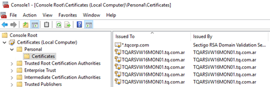

Utilizar aplicación digicert y exportar el archivo según imágenes:

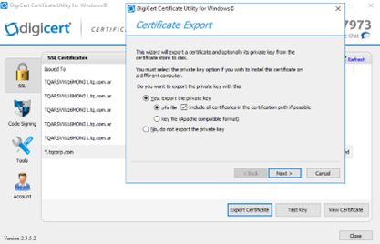

Es importante que la clave para el certificado sea la siguiente: aircontrolenterprise
Utilizar la herramienta KeyStore Explorer y cargar el almacen de la siguiente ruta: 
```
C:\Users\netadmin\Ubiquiti Unifi\data
```

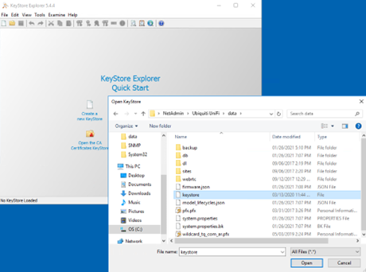

Una vez importado reemplazarlo con el PFX generado desde digicert como PKCS 12:

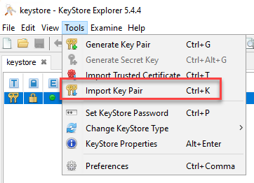

En el caso del ALIAS a la hora de importarlo también dejarlo como se ve en el keystore “unifi”

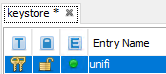

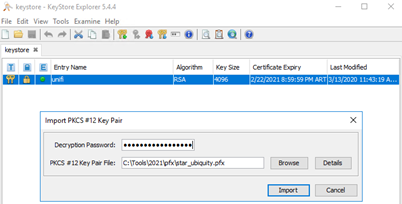

Mantener la misma clave de *aircontrolenterprise*

Pararse en la siguiente ruta

```
c:\Users\netadmin\Ubiquiti UniFi\lib:
```

Y reiniciar unifi con el siguiente comando

```
java -jar ace.jar stopsvc
java -jar ace.jar startsvc
```

# NGINX

Todos los sitios apuntan a las key que existen en los siguientes paths:

- ssl_certificate /etc/nginx/cert/cert.crt;
- ssl_certificate_key /etc/nginx/cert/cert.key;

> Se utiliza la herramienta WINSCP y se accede al server de nginx

Crear una carpeta en el home, en el ejemplo se llama ssl21
Copiar el archivo .CERT y .KEY en:

```
/home/uroot/cert
```

El archivo .cert tiene que contener las entidades intermedias, esto es bundle+cert
Con sudo ejecutar los siguientes comandos para sobre escribir los archivos:
```
mv -f /home/uroot/cert/cert.crt /etc/nginx/cert/cert.crt
mv -f /home/uroot/cert/cert.key /etc/nginx/cert/cert.key
service nginx restart
```

# Serv-U SFTP Y HTTPS

La renovación de los certificados consiste en reemplazar con el mismo nombre los archivos de certificados ubicados en el servidor **TQARSVW16AP04**, para el reemplazo es necesario que el servicio de Serv-U este apagado.

Se adjunta imagen con el detalle de archivos a reemplazar:

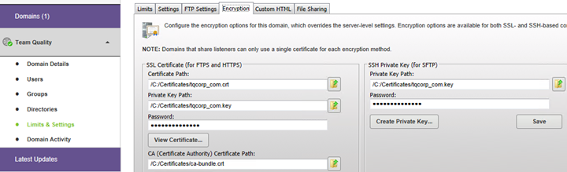

Con configuración de encripcion solamente esta disponible en el dominio Team Quality y no a nivel global del server.

# DEVOPS y TS01

Ingresar a TQARSVW19DO01 y a la consola de IIS Manager

Parados sobre el HOME del servidor ingresar a **IIS-Server Certificates**

Boton derecho del mouse y seleccionar **“Import”**, realizar la importación del archivo *.pfx*

>Es sumamente importante tildar Allow this certificate to be exported

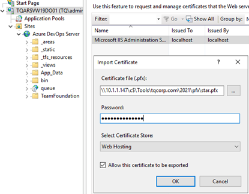

Seguir los pasos de la imagen para reemplazar el certificado en el binding del web site

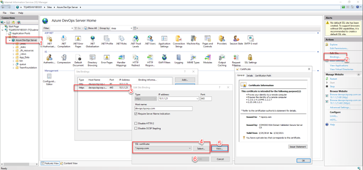

Reiniciar el IIS

Con el mismo procedimiento se reemplaza el certificado en IIS de **TQARSVW16TS01** que da servicio de Terminal Services.

El sitio en TS01 es el siguiente:

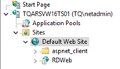

# DELL Switches (opcional)

> Se utiliza la computadora 10.1.1.147 como FTP server con credenciales de user y pass dell

En la carpeta con permisos para el usuario dell dejar 2 archivos:

* private.key
* wildcard.crt

Desde el switch copiar los arvhivos con los siguientes comandos:

```
copy ftp://dell@10.1.1.147/private.key flash://sslt_key2.pem
copy ftp://dell@10.1.1.147/wildcard.crt flash://sslt_cert2.pem
```

Se copian los archivos a la posición 2 de certificados

Desde modo config ejecutar los siguientes 2 comandos

```
no ip http secure-server
ip http secure-server
```

# Portainer

Conectarse por **winscp** a  -i y reemplazar los archivos ubicados en el siguiente path:

```
/etc/docker/certs.d/tqcorp.com
```

Dentro de ese folder los dos archivos son:

- ca.crt
- ca.key

Se renombran los archivos **star.crt** y **star.key** para que coincidan

Copiar inicialmente los archivos a la siguiente ruta:

```
/home/uroot/cert
```

Ejecutar los siguientes comandos:

```
mv -f /home/uroot/cert/ca.crt /etc/docker/certs.d/tqcorp.com/ca.crt
mv -f /home/uroot/cert/ca.key /etc/docker/certs.d/tqcorp.com/ca.key
```

Reiniciar servidor

# Skyline Health

Copiar los certificados *.crt* y *.key* al **home del servidor con winscp**

Renombrar los archivos como *rui.crt* y *rui.key*

Ejecutar los siguientes comandos desde la carpeta donde se encuentran los nuevos certificados:

```
cp rui.crt rui.key /opt/vmware-shd/vmware-shd/conf/ssl/
```

Restart the web server by running systemctl restart nginx.

# Cloud Connect

Utilizar la consola de veeam backup e ir a la solapa de cloud connect e ir a la opción manage certificates

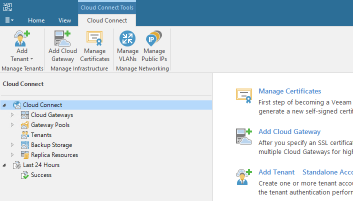

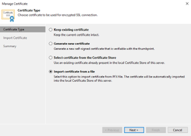

Utilizar archivo .pfx con la clave correspondiente

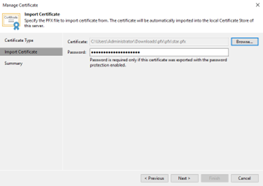


# Portainer

Reemplazar los certificados en el siguiente directorio en **TQARSVLU22DK01**

```
/home/uroot/data/portainer/certs
```

**Archivos:**

- ca.crt
- ca.key

# Snipe-IT

Reemplazar los certificados en el siguiente directorio en **TQARSVLU22DK01**

```
/home/uroot/data/snipe_it/keys
```

- cert.crt
- cert.key

# VaultWarden

Se deben importar los certificados a la aplicación de **NGinx Proxy Manager** en: http://10.1.1.95:8881/

Se importa el certificado en la solapa SSL Certificates

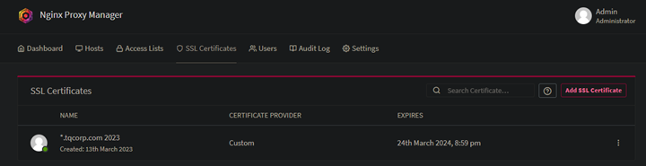

Después se cambia el certificado a utilizar en la solapa hosts eligiendo el nuevo certificado a utilizar

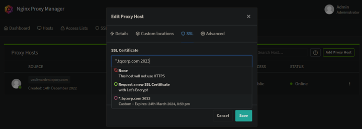

# NGINX DMZ

Reemplazar los certificados en el siguiente directorio en TQARSVLU22DK02

```
/home/uroot/nginx/cert
```

**Los archivos a reemplazar son:**

- cert.crt
- cert.key
- certdev.crt
- certdev.key

# Nexus artefactos

Reemplazar el contenido de los archivos ```cert.crt``` y ```cert.key``` en la siguiente ubicacion:
```
/opt/nexus/deploy/traefik-conf/.certs
```
Reiniciar el stack de servicio de nexus con el docker compose de la siguiente ubicaicon:
```
./opt/nexus/deploy/docker-compose.yml
```


**Detalle de sistemas:**

| Nombre            | IP            | Notas                      |
|-------------------|---------------|----------------------------|
| Fortigate 01      | 10.1.1.254    | 201E                       |
| Fortigate 02      | 10.1.1.253    | 60D                        |
| Fortigate 03      |               | 60D                        |
| Unify ubiquity    | 10.1.1.33     | Hosteado en TQARSVW16MON01 |
| NGINX             | 192.168.11.10 | Hosteado en TQARSVLU22DK02 |
| DevOps2020        | 10.1.1.21     | Hosteado en TQARSVW19DO01  |
| Terminal Services | 10.1.1.31     | Hosteado en TQARSVW16TS01  |
| Serv-U SFTP       | 192.168.11.14 | Hosteado en TQARSVW16AP04  |
| Portainer         | 10.1.1.95     | Hosteado en TQARSVLU22DK01 |
| Nexus             | 10.1.1.90     | Hosteado en TQARSVLU22NX01 |

